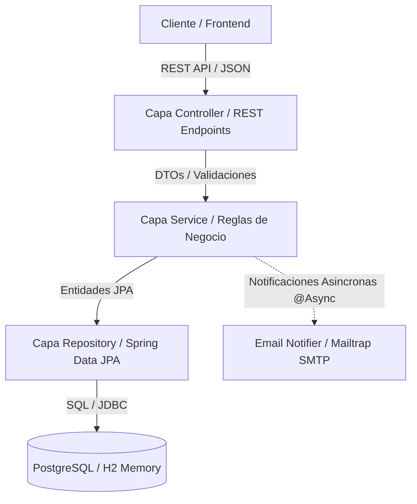

# MediTurno - Plataforma de Gestion de Turnos Medicos

Backend REST API construida en Java 17 y Spring Boot para la automatizacion, reserva y gestion de turnos medicos con control de acceso por roles y notificaciones asincronas en tiempo real.

---

## Tecnologias y Herramientas


---

## Tabla de Contenidos
1. [Descripcion del Problema y Contexto de Dominio](#descripcion-del-problema-y-contexto-de-dominio)
2. [Arquitectura del Sistema](#arquitectura-del-sistema)
3. [Stack Tecnologico](#stack-tecnologico)
4. [Requisitos Previos](#requisitos-previos)
5. [Instalacion y Configuracion](#instalacion-y-configuracion)
6. [Variables de Entorno](#variables-de-entorno)
7. [Endpoints de la API](#endpoints-de-la-api)
8. [Reglas de Negocio Principales](#reglas-de-negocio-principales)
9. [Cobertura de Tests](#cobertura-de-tests)
10. [Decisiones Tecnicas Destacadas](#decisiones-tecnicas-destacadas)
11. [Roadmap](#roadmap)

---

## Descripcion del Problema y Contexto de Dominio

En el ambito de la salud, la asignacion ineficiente de citas medicas representa una perdida economica para los profesionales y una barrera de acceso para los pacientes. Los problemas recurrentes en este tipo de sistemas incluyen:
- Solapamiento de horarios: Medicos agendados en bloques coincidentes.
- Cancelaciones tardias: Pacientes que cancelan a ultimo momento, impidiendo que otros tomen el turno libre.
- Falta de trazabilidad: Perdida de registros historicos de creacion, modificacion y estado de las citas.

MediTurno soluciona estos dolores estructurales dividiendo el dominio en tres roles claramente diferenciados:
- PACIENTE: Puede consultar la disponibilidad publica de slots libres, reservar turnos (siempre que no tenga solapamientos con otras citas propias) y cancelar su cita bajo penalizacion de tiempo.
- MEDICO: Consulta su agenda personalizada y gestiona los turnos (visualizacion de citas asignadas).
- ADMIN: Posee control total sobre el registro de personal medico y la creacion de nuevos bloques de disponibilidad de agenda.

---

## Arquitectura del Sistema

El sistema implementa una arquitectura limpia y desacoplada en capas (Layered Architecture), aislando la logica de entrada/salida de la logica de dominio e infraestructura de persistencia.



---

## Stack Tecnologico

- Lenguaje: Java 17
- Framework Principal: Spring Boot (compatible con 3.x y 4.x)
- Seguridad: Spring Security + JSON Web Tokens (JWT) para autenticacion stateless.
- Persistencia: Spring Data JPA / Hibernate Core.
- Base de Datos: PostgreSQL 16 (Produccion/Local) y H2 Database (Entorno de Test).
- Migracion de Esquema: Flyway Database Migrations.
- Documentacion: Springdoc OpenAPI v3 (Swagger UI).
- Email: JavaMailSender (SMTP) con MimeMessage para envio de correos HTML.
- Testing: JUnit 5 + Mockito 5.
- Gestor de Compilacion: Maven.
- Contenedores: Docker & Docker Compose.

---

## Requisitos Previos

Antes de levantar el proyecto, asegurese de contar con:
- Java JDK 17 o superior instalado localmente.
- Docker y Docker Compose instalados y ejecutandose en su sistema.
- Git para clonar el repositorio.

---

## Instalacion y Configuracion

El proyecto esta completamente contenerizado, lo que permite levantar la infraestructura completa (Base de datos PostgreSQL + Servidor Spring Boot + Migraciones de esquema Flyway automaticas) con un unico comando.

1. Clonar el repositorio:
   ```bash
   git clone https://github.com/Sebastianidm/mediturno.git
   cd mediturno
   ```

2. Crear archivo de variables de entorno:
   Complete sus credenciales SMTP (Mailtrap) para habilitar las notificaciones por email:
   ```bash
   cp docs/env.example .env
   ```

3. Levantar la aplicacion con Docker Compose:
   ```bash
   docker compose up --build
   ```

El servidor estara disponible y escuchando peticiones en el puerto 8080.
La documentacion Swagger interactiva se puede visualizar localmente en: http://localhost:8080/swagger-ui.html.

---

## Variables de Entorno

El proyecto requiere las siguientes variables de entorno para su correcto funcionamiento en produccion y desarrollo local (configuradas en el archivo .env):

| Variable | Descripcion | Ejemplo de Valor |
| --- | --- | --- |
| DB_URL | URL de conexion JDBC a la base de datos PostgreSQL | jdbc:postgresql://db:5432/mediturno |
| DB_USERNAME | Nombre de usuario del motor PostgreSQL | mediturno_user |
| DB_PASSWORD | Contrasena del usuario del motor PostgreSQL | mi_password_secreto |
| JWT_SECRET | Clave secreta usada para firmar los tokens JWT | 3c90735a7e9b4412f1a232ab8811... |
| MAIL_USERNAME | Identificador de usuario SMTP para Mailtrap | mailtrap_user_id |
| MAIL_PASSWORD | Contrasena de autenticacion SMTP para Mailtrap | mailtrap_password_id |

---

## Endpoints de la API

### Modulo de Autenticacion (Auth)
- POST /api/v1/auth/register (Publico): Registra a un nuevo Paciente en el sistema.
- POST /api/v1/auth/login (Publico): Autentica un usuario y devuelve el token de sesion JWT.

### Modulo de Administracion (Admin)
- POST /api/v1/admin/medicos (ADMIN): Registra a un nuevo medico con sus respectivas especialidades.

### Modulo de Agendas medicas (Agenda)
- POST /api/v1/agendas (ADMIN o MEDICO): Registra un nuevo bloque horario de disponibilidad medica.
- GET /api/v1/agendas (Publico): Consulta de forma paginada los bloques horarios disponibles (slots libres).

### Modulo de Turnos (Turnos)
- POST /api/v1/turnos (PACIENTE): Reserva un turno en base a un bloque de disponibilidad asignado.
- POST /api/v1/turnos/{id}/cancelar (Autenticado): Cancela un turno activo (aplica reglas de anticipacion).
- GET /api/v1/turnos/mis-turnos (Autenticado): Lista los turnos asociados al usuario logueado segun su rol (Pageable).

---

## Reglas de Negocio Principales

El backend de MediTurno implementa estrictamente las siguientes cuatro reglas fundamentales del negocio en la capa de servicios:

1. Validacion de Disponibilidad Anti-solapamiento:
   Un medico no puede registrar bloques horarios de agenda que coincidan o se crucen en fecha y hora de inicio/fin en el sistema.
2. Reserva Unica de Pacientes (Anti-solapamiento de Turnos):
   Un paciente no puede agendar un turno en el pasado ni reservar multiples citas confirmadas en el mismo rango horario de un mismo dia.
3. Verificacion de Propiedad de Citas (Seguridad de Cancelacion):
   Al cancelar un turno, si el usuario no es ADMIN ni MEDICO, se valida de forma prioritaria que el paciente autenticado sea el dueno legitimo de dicha cita (turno.paciente.id == usuarioAutenticado.id) antes de proceder con cualquier otra validacion de negocio.
4. Politica de Limite de Cancelacion de Pacientes:
   Los pacientes solo pueden cancelar citas con una antelacion minima de 2 horas. Si la cita ocurre en menos de 2 horas, la operacion es rechazada. Medicos y administradores no tienen esta restriccion y pueden cancelar citas en cualquier momento.

---

## Cobertura de Tests

El proyecto implementa una bateria de 26 pruebas automaticas robustas que validan de forma aislada tanto la capa de logica de negocio como los endpoints del controlador REST:
- Tests Unitarios (JUnit 5 + Mockito): Validan que todas las validaciones de negocio en TurnoService y AgendaMedicaService funcionen al 100% bajo escenarios de exito y error.
- Tests de Integracion de Controlador (MockMvc Standalone): Validan respuestas HTTP, serializacion de DTOs en JSON y restricciones de acceso sin la sobrecarga del levantamiento completo del contexto de la base de datos externa.
- Independencia en pruebas: La base de datos H2 en memoria y configuraciones de test aislan por completo las pruebas del entorno de desarrollo local.

### Cobertura de Codigo (JaCoCo)
Mediante la ejecucion de ./mvnw verify, el plugin jacoco-maven-plugin genera reportes en target/site/jacoco/index.html asegurando que la cobertura de codigo cumpla y exceda el 80% minimo obligatorio de cobertura en ramas y lineas clave de logica medica.

---

## Decisiones Tecnicas Destacadas

### 1. ¿Por que persistencia relacional en lugar de persistencia poliglotas (NoSQL/Redis)?
Aunque las soluciones NoSQL ofrecen alta disponibilidad, el negocio de reserva de turnos requiere una consistencia estricta (ACID). El uso de PostgreSQL garantiza la integridad referencial, bloqueos consistentes y transacciones para evitar el problema de doble reserva (dos pacientes reservando el mismo slot al mismo tiempo). Introducir persistencia poliglotas aumentaria la complejidad de sincronizacion y consistencia eventual sin justificacion tecnica en esta fase.

### 2. Procesamiento Asincrono (@Async) para Notificaciones por Email
El envio de correos HTML a traves de servidores SMTP externos (como Mailtrap) añade una latencia que oscila entre 300ms y 2 segundos. Si el envio se realizara de forma sincrona en el hilo de la peticion HTTP, el paciente experimentaria una API lenta. Con @Async, Spring delega el envio del email a un pool de hilos en segundo plano, devolviendo la respuesta HTTP de exito de manera inmediata.

### 3. Paginacion Obligatoria (Pageable y Page)
Los endpoints de consulta publica de disponibilidad medica y de turnos personales pueden retornar miles de registros a medida que la base de datos crece. La paginacion previene desbordamientos de memoria del servidor (Out Of Memory) y optimiza la velocidad de respuesta reduciendo el consumo de ancho de banda y la latencia de red.

---

## Roadmap

- Fase 7: Desarrollo y acoplamiento de un cliente Frontend web SPA dinamico utilizando React.js y TailwindCSS bajo los lineamientos esteticos modernos.
- Fase 8: Desarrollo de la aplicacion movil nativa/hibrida para Pacientes y Medicos (planificada para el 4to semestre de la carrera).
- Notificaciones Push: Integracion con Firebase Cloud Messaging (FCM) en el Roadmap Mobile.
